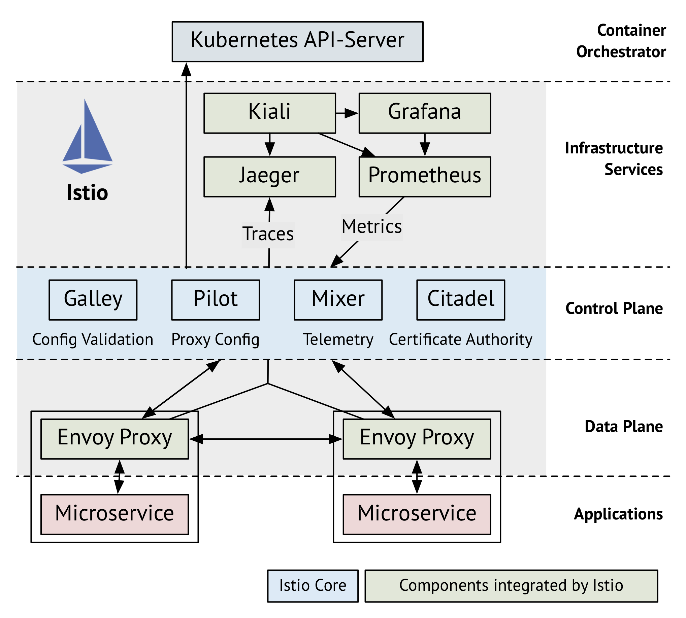
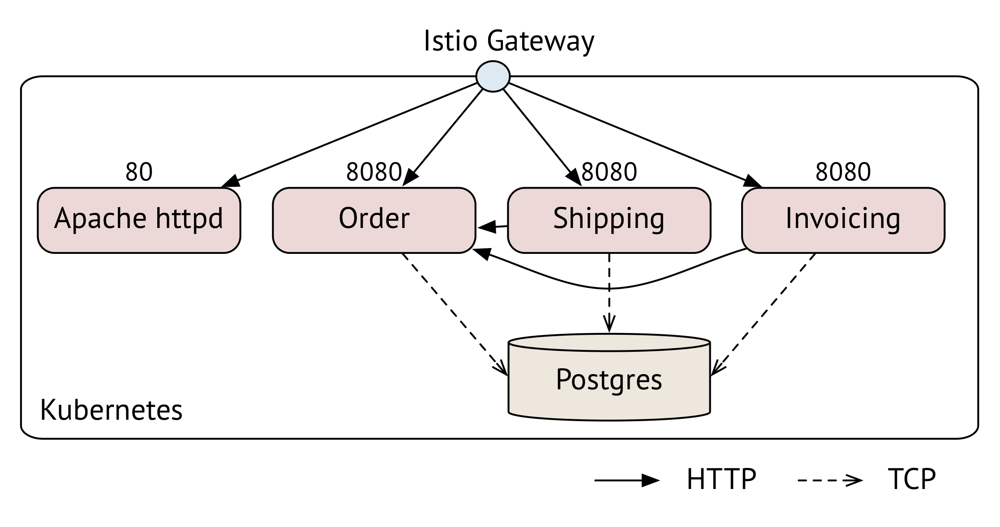
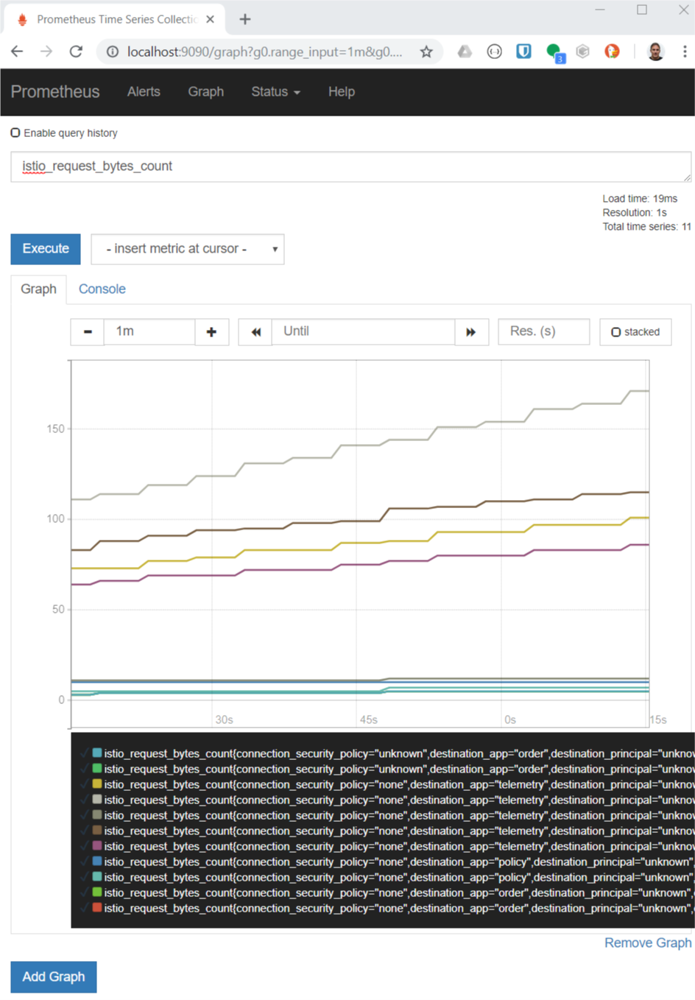
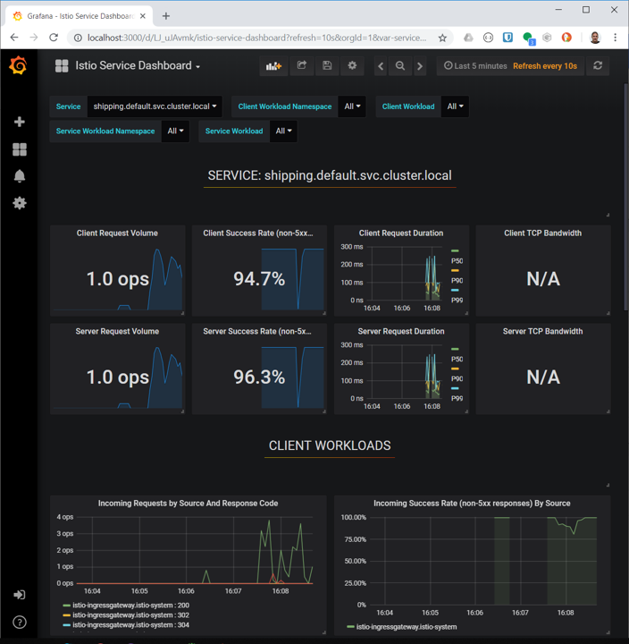
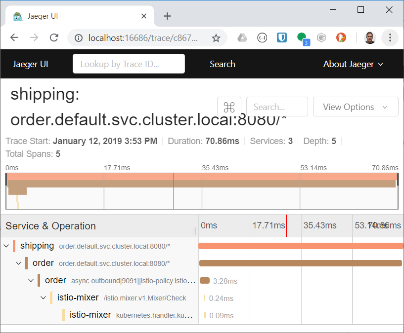
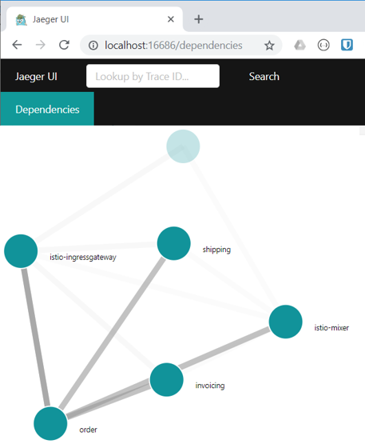
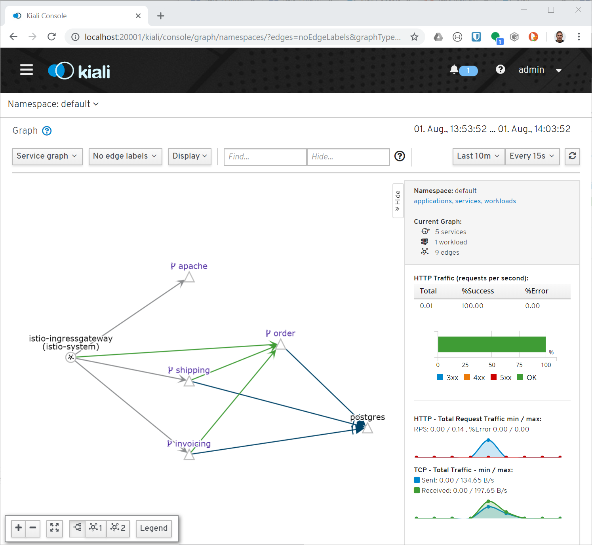
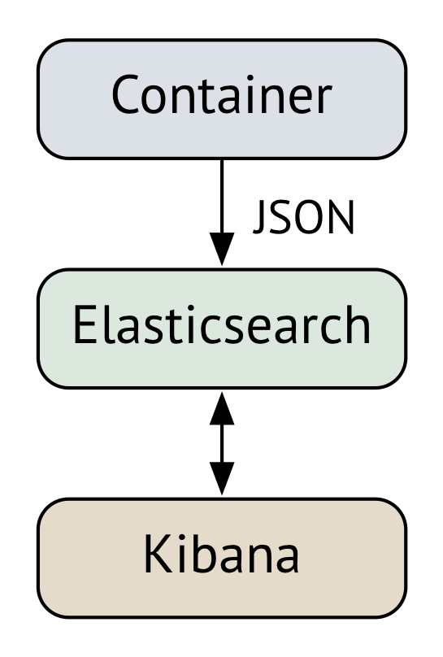

# Example with Istio  {#chapter-example}

Typically, an example that shows a technology in action is a great way
to understand how it actually works. This chapters shows a system
consisting of multiple microservices and shows how a service mesh can
add value to a microservices architecture. The example runs on
Kubernetes and uses Istio as a service mesh.

## Istio

Istio is the most popular service mesh, developed by Google and
IBM. Just like Kubernetes, it is an Open Source reimplementation of a
part of Google's internal infrastructure. Istio implements all service
mesh features described in the [previous chapter](#chapter-what) such as
metrics, logging, tracing, traffic routing, circuit breaking, mTLS, and
authorization. Although Istio is designed to be platform-independent, it
started with first class support for Kubernetes.

[Figure 4.1](#fig-example-istio) reflects how the service mesh is
located between the orchestrator (top) and the application
(bottom). The four core components of Istio make up the control plane:
Galley, Pilot, Mixer, and Citadel. They communicate with the service
proxies to distribute configurations, receive recorded network traffic
and telemetry data, and manage certificates. Istio uses [*Envoy*](https://www.envoyproxy.io)
as service proxy, a widely adopted open source proxy that is used by
other service meshes, too.

{id="fig-example-istio"}

In addition to the typical service mesh control and data plane, Istio also adds infrastructure services. They support monitoring the microservice applications. Instead of developing its own tools, Istio integrates established applications such as  *Prometheus*, *Grafana*, and *Jaeger* and the service mesh dashboard *Kiali*. The image shows that the Istio control plane interacts with the orchestrator, which today is in most cases Kubernetes.

In a Kubernetes environment, Istio adds over 20 Custom Resource Definitions (CRDs), which represents the complexity of the Istio API and the richness of configuration options. On the one hand, this allows full customization but on the other hand it clearly affect the usability. Istio also adds a number of components (marked as Istio Core and integrated components in the figure) to an application which add technical complexity.

## Overview {#section-example-overview}

The example in this chapter contains three microservices: Users can enter new orders
via a web interface of the *order* microservice. The
data about the order is transferred to the *invoicing* microservice
that will create an invoice and present it to the user. The *shipping*
microservice will use the data about the order to create a
shipment. The invoicing and the shipping microservice present a web
interface to the user, too.

{id="fig-example-overview"}

[Figure 4.2](#fig-example-overview) shows the structure of the
example:

* Istio provides the *Ingress Gateway*. It forwards HTTP requests to
  the microservices. In addition to the features of the Kubernetes
  Ingress, the Istio Gateway supports Istio's features mentioned
  previously, such as monitoring or advanced routing.
  
* *Apache httpd* provides a static HTML page that serves as the
  home page for the example. The page has links to each
  microservice.
  
* *Order, shipping,* and *invoicing* are microservices. Shipping and
  invoicing poll data about the orders from the order
  microservice using REST. Istio understands HTTP and REST so it can
  support this interface very well. The data format
  is based on JSON. The feed contains a simple JSON
  documents with a list of link to the individuals orders.
  
* All three microservices use the same *Postgres database*.
  
#### Run the Example

You can access the code for the example at
<https://github.com/ewolff/microservice-istio>. The
[documentation](https://github.com/ewolff/microservice-kubernetes/blob/master/HOW-TO-RUN.md)
explains in detail how to install the required software and how to run
the example.

## How the Example Uses Istio {#section-example-istio}

A closer look at the `microserivces.yaml` file shows
that the deployment for the microservices has no Istio-specific
information. This is an advantage that makes it
easier to use Istio. It also means that Istio works with any type of
microservice no matter what programming language or frameworks
are used.

However, Istio supports features such as resilience
and monitoring as mentioned. Somehow Istio needs to collect
information about the microservices.

#### Sidecar

As mentioned in [chapter 2](#chapter-what), the idea behind a
*sidecar* is to add another
Docker container to each Kubernetes pod. Actually, if you list the
Kubernetes pods with `kubectl get pods`, you will notice that for each
pod it says `2/2`:

{linenos=off}
~~~~~~~~
[~/microservice-istio]kubectl get pods
NAME                READY STATUS  RESTARTS AGE
apache-7f7f7f79c6    2/2  Running 0        8m51s
invoicing-77f69ff854 2/2  Running 0        8m43s
order-cc7f8866       2/2  Running 0        8m43s
postgres-5ddddbbf8f  2/2  Running 0        8m51s
shipping-5d58798cdd  2/2  Running 0        8m43s
~~~~~~~~

So while there is just one Docker container configured for each
Kubernetes pod, two Docker containers are in fact running. One
container contains the microservice, and the other contains the
sidecar that enables the integration into the Istio infrastructure.

Istio automatically injects these containers into each pod. During the
installation described previously, `kubectl label namespace default
istio-injection=enabled` marked the `default` namespace so that Istio
injects sidecars for each pod in that namespace. Namespaces are a
concept in Kubernetes to separate Kubernetes resources. In this example,
the `default` namespace contains all Kubernetes resources
that the user provides. The namespace `istio-system` contains
all Kubernetes resources that belong to Istio itself.

The sidecars contain the proxies. Istio routes all traffic between the
microservice through these proxies as described in [chapter
2](#chapter-what).

## Monitoring with Prometheus and Grafana {#section-example-monitoring}

As mentioned in [section 2.1](#section-why-monitoring), a service mesh
provide basic monitoring information without any additional
effort. Istio includes *[Prometheus](https://prometheus.io/)* to store
metrics for analysis. Istio also includes
*[Grafana](https://grafana.com/)*; a tools for the analysis of
the metrics.

Of course, this approach supports only metrics that the proxy can
measure. This includes all the information about the request, such as
its duration or the status code. Also, information about the
Kubernetes infrastructure -- for example, CPU utilization -- can be
measured. However, data about the internal state of the microservice
is not measured. To get that data, the microservice would need to
report it to the monitoring infrastructure.

#### Prometheus

The [documentation of the
example](https://github.com/ewolff/microservice-istio/blob/master/HOW-TO-RUN.md#prometheus)
contains information how to run Prometheus in the example.

Prometheus stores all metrics and also provides a simple UI to analyze
the metrics. [Figure 4.3](#fig-example-prometheus) shows the
byte count for requests and the different destinations: the order
microservice and also the Istio component that measures the telemetry
data.

Prometheus is multi-dimensional. The destination is one dimension of
the data. These metrics could be summed up by dimensions such as the
destination, to understand which destination receives how much
traffic.

{id="fig-example-prometheus", width=65%}

<!-- I suggest removing the browser frame from all images -->

#### Grafana

For more advanced analysis of the data, Istio provides an
installation of Grafana. The
[documentation](https://github.com/ewolff/microservice-istio/blob/master/HOW-TO-RUN.md#grafana)
explains how to use Grafana with the example.

The Grafana installation in Istio provides predefined
dashboards. [Figure 4.4](#fig-example-grafana) shows an example
of the Istio service dashboard. It uses the shipping
microservice. The dashboard shows metrics such as the request
volume, the success
rate and the duration. This gives a great overview about the
state of the service.

{id="fig-example-grafana", width=65%}

Istio supplies also other dashboards.
The Istio performance dashboard provides a general overview about the
state of the Kubernetes cluster with metrics such as memory
consumption or CPU utilization. The Istio mesh dashboard shows a
global metric about the number of requests the service mesh processes
and their success rates.

So just by installing Istio, basic monitoring for all microservices is
already in place.

## Tracing {#section-example-tracing}

As explained in [section 2.1](#section-why-monitoring), tracing might
be important to trace calls across microservices and do a root cause
analysis based on that information.
For tracing, Istio uses [Jaeger](https://www.jaegertracing.io/).

The documentation of the example contains a
[section](https://github.com/ewolff/microservice-istio/blob/master/HOW-TO-RUN.md#tracing)
about tracing.

{id="fig-example-tracing", width="60%"}

[Figure 4.5](#fig-example-tracing) shows an example of a
trace for a request to the shipping microservice. The
user started a poll for new data on the order microservice. Then the
service contacted the Istio Mixer to make sure the policies are enforced.

[Figure 4.6](#fig-example-tracing-dependencies) shows a different type of
information Jaeger provides: the dependencies between the
microservices. Shipping and invoicing use order to receive the
information about the latest orders. Order reports metrics to
Mixer. And finally, order is accessed by the Istio gateway when
external requests are forwarded to it. This information about
dependencies might be useful to get an overview about the architecture
of the system.

{id="fig-example-tracing-dependencies", width="60%"}

To understand which incoming request caused which outgoing requests,
Jaeger relies on specific HTTP header. The values in the headers of
the incoming requests have to be added to any outgoing request.  This
means that tracing cannot be transparent to the microservices. They
have to include some code to forward the tracing headers from the
incoming request to each outgoing request.

#### Code for Tracing

The example uses [Spring Cloud
Sleuth](https://spring.io/projects/spring-cloud-sleuth). This is a
powerful library that supports many features for tracing. Spring Cloud
Sleuth just needs to forward the HTTP headers. So in
`application.properties` the parameter
`spring.sleuth.propagation-keys` contains the HTTP headers that must
be forwarded.  The `x-b3-*` headers are automatically forwarded by
Spring Cloud Sleuth so just the `x-request-id` and `x-ot-span-context`
header have to be configured.
Other languages require different means to forward the HTTP
headers.

## Visualization with Kiali

With the information from the tracing, Jaeger can provide a graph with
the dependencies between the microservices. However,
[Kiali](https://www.kiali.io/) is a tool that is specialized in
generating dependency graphs of microservices. It also shows traffic
rates, latencies, and health of the services.  That way, it provides
not just a great overview of the microservices and their relationships
but also information about how they are communicating with each
other. That makes it clearer what the status of the dependencies is
and what is going on where in the microservices system.
[Figure
4.7](#fig-example-kiali) shows an example of a dependency graph.

{id="fig-example-kiali", width="70%"}

The
[documentation](https://github.com/ewolff/microservice-istio/blob/master/HOW-TO-RUN.md#kiali)
explains how to use Kiali for the example.

## Logging {#section-example-logging}

As explained in [section 3.2](#section-why-logging), service meshes
are of little help for logging. However,
Istio can forward information about each HTTP request to a logging
infrastructure. That information can be used to analyze, for example,
the number of requests to certain URLs and status codes.  A lot of
statistics for web sites rely on this kind of information.

The format in the logs can be configured. A log entry may contain any
information Mixer received from the request.

#### Logs in the Example

However, Istio does not provide an infrastructure to handle logs.
For the example, a custom log infrastructure was set up. This
infrastructure uses Elasticsearch to store logs and Kibana to analyze
them.

{id="fig-example-logging", width="30%"}

[Figure 4.8](#fig-example-logging) shows how logging is implemented in the
example. Each microservice must directly write JSON data to the
Elasticsearch server. So there is no need to write any log files which
makes the system easier to handle. The need to parse the log
information has also been eliminated; Elasticsearch can directly
process it.

#### Code for Logging

The example uses the [Logback](https://logback.qos.ch/) Java
library. The [Logback Elasticsearch
Appender](https://github.com/internetitem/logback-elasticsearch-appender)
forwards the logs to Elasticsearch. The configuration in the file
`logback-spring.xml` defines what information the microservices log.

The Istio infrastructure could log to the same Elasticsearch instance,
too. However, for the example, it was decided that this is not
necessary. With the current system, it is easy to find problems in the
implementation by searching for log entries with severity error. Also
logging each HTTP request adds little value.  Information about the
HTTP requests is probably already included in the logs of the
microservices.

## Resilience {#service-mesh-resilience}

Resilience means that a microservice should not fail if other
microservices fail. It is important to avoid failure cascades that
could bring down the complete microservices system.

#### Measuring Resilience with Istio

As explained in [section 3.3](#section-why-resilience), failure
cascades can happen if a called microservice returns an
error. It could be even worse if the called microservices does return
successfully but takes a long time. In that case, resources such as
threads might be blocked while waiting for a reply. In the worst case,
all threads end up blocked and the calling microservice fails.

Such scenarios are hard to simulate. Usually the network is
reasonably reliable. It would be possible to implement a stub
microservice that returns errors, but that would require some
effort.

However, Istio controls the network communication through the
proxies. It is therefore possible to add delays and errors to specific
microservices. Then the other microservices can be checked to see if
they are resilient against the delays and failures.

#### Fault Injection

The configuration in the file `fault-injection.yaml`
from the example. It makes 100 percent of the calls to the order microservice
fail with HTTP status 500. See the
[documentation](https://github.com/ewolff/microservice-istio/blob/master/HOW-TO-RUN.md#fault-injection)
about how to apply this configuration to your system.

Actually, the microservice will still work after applying the fault
injection. If you add a new order to the system,though, it will not be
propagated to shipping and invoicing. You can make those microservices
poll the order microservice by pressing the pull button in the web UI
of shipping and invoicing. In that case, an error will be shown. So
the system is already quite resilient because it uses polling.
If the shipping microservice would call the order microservice
-- for example, to fulfill a request --, the shipping
service would fail after the fault injection if no additional logic is
implemented to handle such a failure.

#### Delay Injection

Another possibility is to inject a delay, see the
[documentation](https://github.com/ewolff/microservice-istio/blob/master/HOW-TO-RUN.md#delay-injection). If
you make the shipping microservice poll the order microservice, it
will take longer but it will work fine. Otherwise the system just
works normally. So again due to polling the system is already quite
resilient.

#### Implementing Resilience with Istio

Fault and delay injection are just useful to test the resilience of a
system. However, as explained in [section
3.3](#section-why-resilience) circuit breaker are one way to actually
make a system
more resilient. 

{linenos=off, lang="yaml"}
~~~~~~~~
apiVersion: networking.istio.io/v1alpha3
kind: DestinationRule
metadata:
  name: order-circuit-breaker
spec:
  host: order.default.svc.cluster.local
  trafficPolicy:
    connectionPool:
      tcp:
        maxConnections: 1
      http:
        http1MaxPendingRequests: 1
        http2MaxRequests: 1
        maxRequestsPerConnection: 1
    outlierDetection:
      consecutiveErrors: 1
      interval: 1m
      baseEjectionTime: 10m
      maxEjectionPercent: 100
~~~~~~~~

The previous listing shows a configuration of a circuit breaker for
Istio. See the
[documentation](https://github.com/ewolff/microservice-istio/blob/master/HOW-TO-RUN.md#circuit-breaker)
about how to apply it. The
configuration has the following settings:

* A maximum of one TCP connection is allowed for the service
  (`maxConnections`).

* There may be just one request per connection
  (`maxRequestsPerConnection`).

* In total, just one HTTP 1.1 (`http1MaxPendingRequests`) and one HTTP
  2 (`http2MaxRequests`) request might be pending.
  
* Each minute, each microservice instance is checked (`interval`). If
  it has returned one error (`consecutiveErrors`) -- that an HTTP
  status 5xx or a timeout -- it is excluded from traffic for ten
  minutes (`baseEjectionTime`). All instances of the microservice
  might be excluded from traffic in this way (`maxEjectionPercent`).

* Exceeding the connection limits (maxConnections,
  maxRequestsPerConnection, http1MaxPendingRequests, http2MaxRequests)
  will also result in an error state and trigger the circuit breaker.

These limits protect the microservice from
too much load. And, if an instance has already failed, it
is excluded from the work. That gives the instance a chance to
recover.

The limits in the example are very low to make it easy to trigger the
circuit breaker. If you use the `load.sh` script to access the order
microservice's web UI, you will need to run a few instances of the
script in parallel to receive 5xx error codes returned by the circuit
breaker.

If the circuit breaker does not accept a request because of
the defined limits, the calling microservice will receive an
error. So the calling microservice is not protected from a failing
microservice.

##### Retry and Timeout

Retries and timeouts as explained in [section
3.3](#section-why-resilience) can be defined in the same part of
the Istio configuration. That makes it easy to define a timeout per
retry and a maximum time span that all retries together might take.

{linenos=off, lang="yaml"}
~~~~~~~~
apiVersion: networking.istio.io/v1alpha3
kind: VirtualService
metadata:
  name: order-retry
spec:
  hosts:
  - order.default.svc.cluster.local
  http:
  - retries:
      attempts: 20
      perTryTimeout: 5s
      retryOn: connect-failure,5xx
    timeout: 10s
    route:
    - destination:
        host: order.default.svc.cluster.local
~~~~~~~~

The previous listing shows a part of the file `retry.yaml`. It configures
retries and timeouts for the order microservice. Calls to the order
microservice are retried up to 20 times. For each retry, a timeout of
5 seconds is configured. However, there is also a total timeout of
10 seconds. So if the retries don't succeed after 10 seconds, the call
will fail. The Istio's default timeout is 15 seconds.

`retryOn` define when a request is considered failed. In this case any
HTTP status code 5xx, or connection failures such as timeouts are
considered failed requests.

The rest of the file is not shown in the listing. It adds retries to
the Istio Ingress gateway for the order microservice.

See the
[documentation](https://github.com/ewolff/microservice-istio/blob/master/HOW-TO-RUN.md#retry)
about how to make the order service fail and then fix the problem by
applying this configuration to the system.

#### Resilience: Impact on the Code

Istio's circuit breaker makes it more likely that a call to a
microservice fails. The same is true for a timeout. Retries can reduce
the number of failures. But even with Istio's resilience features,
there will still be calls to
microservices that fail. So while retry, timeout, and circuit breaker
do not require any changes to the code, the code still needs to take
of care of failed requests. Those result in a response with HTTP
status code 5xx. How failures are handled is a part of the domain
logic. For example, if the warehouse management is down, it might not
be
possible to determine the availability of certain items. Whether an
order should be accepted -- even though the availability of the ordered
items is unknown --, is a business decision.
Maybe it is fine to accept the order and deal with the unavailable
items. Maybe this would disappoint customers or violate contracts and
is therefore not an option.
So there must be code that
handles an HTTP status code 5xx and determines whether the order
should still be processed.

## How to dig deeper

Istio provides extensive documentation. You can use it to
familiarize yourself with features of Istio that this chapter does not
discuss: 

- Istio provides a list of [tasks](https://istio.io/docs/tasks/). They
  provide hands-on guidelines how to gain more experience with Istio
  and are therefore a great addition to this chapter.

- Istio provides support for security. See [the security
  task](https://istio.io/docs/tasks/security/) for some hands-on
  exercises
  for this feature. The exercises cover encrypted communication,
  authentication and authorization.

- Istio also supports advanced routing. For example, [the traffic
  shifting
  task](https://istio.io/docs/tasks/traffic-management/traffic-shifting/) 
  shows how to do A/B testing with Istio. 
  The [mirroring
  task](https://istio.io/docs/tasks/traffic-management/mirroring/)
  shows
  mirroring. With mirroring, two versions of the microservice receive
  the traffic. Mirroring can be used to make sure that the new and the
  old version behave in the same way.
  
- This 
[example](https://istio.io/docs/tasks/telemetry/metrics-logs/)
discusses how Istio support logs,
showing how log information can be composed from Mixer's data. This
example outputs the logs to stdout and not to a log infrastructure.

- Also, this 
[example](https://istio.io/docs/tasks/telemetry/fluentd/) shows
how [Fluentd](https://www.fluentd.org/) collects the
logs Istio provides from all microservices. The logs are stored in
Elasticsearch and evaluated with Kibana.

## Conclusion

The example shows how Istio provides a complete monitoring environment
and basic monitoring information for the microservices system without
any additional code. The microservices are treated as black boxes
i.e. the metrics only cover the communication between the
microservices and the infrastructure. However, this could in fact be
enough for a production system as it shows the performance as
experiences by the user.

Some code has to be added to the microservices for tracing so that
they forward the tracing headers to the outgoing HTTP requests. Still
the complete infrastructure is provided by Istio.

Istio does not provide an infrastructure for logging. However, it can
log information for each HTTP request to a logging
infrastructure. However, logging is often used to look inside the
microservices and understand what they actually do. This can only be
implemented in the code of the microservices. Still Istio could at
least provide some very basic information in the logs without any
impact on the code or the microservices.

Istio allows to simulate problem in the system by injecting delay and
faults. That is useful to test the system's resilience. Istio's
circuit breaker and retries even help to implement resilience. If a
microservices fails, the system still needs to compensate that
failure. Dealing with a failed service must be covered by the domain
logic. The microservices in the example are self-contained i.e. all
data for the logic is stored in the microservice. So a failed
microservice has very limited impact. However, his is a feature of the
architecture and not the service mesh.
