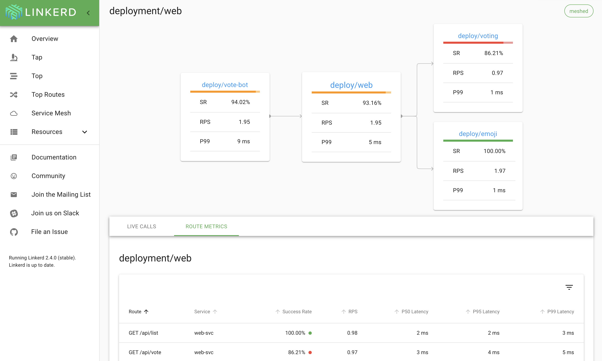

# Other Service Meshes {#chapter-other}

While Istio is the most popular service mesh, the market is quite diverse and worth evaluating. The first service mesh implementation was Linkerd, developed in 2015. In 2017, Google and IBM joined forces to create the Istio service mesh after they found out they have been working on similar ideas. The public attention Istio received through Google and IBM as main contributors was amplified by media campaigns and conference talks. By the end of 2017, Linkerd announced a new, more opinionated service mesh only for Kubernetes that was first named Conduit and later Linkerd 2. By 2018, the term service mesh was ubiquitous and more products and companies joined the party. Consul added service mesh features and AWS announced their own service mesh implementation AWS App Mesh.

## Linkerd 2 {#section-other-linkerd2}

Linkerd 2 is the successor of Linkerd.
Although Linkerd had been adopted in large production systems, the software was too complex to configure and not performing well. These limitations induced Buoyant to develop a completely new service mesh. The result - formerly Conduit, today called Linkerd 2 - was presented in December 2017 as an open source project, written in Go and Rust. Linkerd 2 is an incubation project of the CNCF (Cloud Native Computing Foundation) and currently the only service mesh in the CNCF portfolio.

Although Kubernetes is the most common platform to be used with Istio, it is designed to work with any environment. The complexity of Istio is to some extent caused by this platform neutral design. While the first version of Linkerd was designed alike, Linkerd 2 benefits from its commitment to Kubernetes. Linkerd implements most service mesh features such as monitoring, routing, retries, timeouts, and mTLS. Circuit breaking, tracing, and autorization are missing. Unlike other service mesh implementations, which use the third-party service proxy Envoy, Linkerd includes its own implementation of a service proxy (linkerd-proxy).

Rewriting Linkerd for usability and performance while integrating with Kubernetes seems to have worked out. The API of Linkerd 2 is much cleaner and more consistent than Istio's. It has only one CRD (Custom Resource Definition) that has to be used in a Kubernetes configuration. Istio has 23 CRDs. Linkerd 2 also provides a carefully considered dashboard, shown in [figure 5.1](#fig-other-linkerd-dashboard). Kubernetes users should seriously consider it since it includes most service mesh features in a production ready stage, has a small resource and performance footprint, and provides an excellent developer experience.

<!--TODO: refined Timeouts and retrys-->

<!--TODO: concept of tap-->

<!--TODO: minimal-invasiv durch Ingress-->

{id="fig-other-linkerd-dashboard"}

## Consul {#section-other-consul}

Consul, originally a solution for service discovery, recently added service mesh use cases. Consul supports service discovery, authorization, mTLS, monitoring through metrics, and routing capabilities. The latter were added by integrating with the Envoy proxy that Istio and other service meshes are also using. Resilience features like circuit breaking, retry, and timeout are yet to be developed. Like Istio, Consul does not depend on any specific orchestration platform.

<!--TODO: Screenshot, details-->

<!--TODO: Dokumentation-->

<!--TODO: API-->

<!--TODO: Kubernetes-Support-->

## AWS App Mesh {#section-other-aws-app-mesh}

As the name suggests, AWS App Mesh is a service mesh developed for AWS. It was first introduced in November 2018. Like Istio and Consul, AWS App Mesh uses a pre-configured but customizable Envoy as service proxy and adds its own control plane. It is integrated with other AWS tools like CloudWatch for metrics and X-Ray for traces. AWS App Mesh already supports essential service mesh features like monitoring, routing and mTLS. AWS users can activate App Mesh in Fargate, EC2, EKS, and EC2 and add configuration through JSON. In Kubernetes environments, configuration can be applied through CRDs and applied by the [AWS App Mesh Controller](https://github.com/aws/aws-app-mesh-controller-for-k8s).

AWS is the most recent service mesh implementation, but since AWS has the biggest market share for cloud computing, AWS App Mesh is expected to stay and grow.  

<!--TODO: Screenshot?-->

<!-- I like the recommendation concerning Linkerd 2 above. Will you provide something similar for App Mesh? -->

## When to Choose Which? {#section-other-choose}

The features a service mesh provides seem to be useful for the vast majority of microservice applications. When it comes to choosing a specific service mesh implementation, it is hard to resist going with Istio as it is the most popular one. But experience shows that technical decisions are best based on requirements and problems rather than any hype, a projects public attention, or even its number of features.

As shown in [figure 5.2](#fig-other-service-mesh-comparison) Istio overtook all other service mesh implementations in terms of feature completeness and configurability. But these properties have made Istio an complex component that can be hard to manage in practice. In cases where not all features and their customizability are required, Linkerd, Consul and AWS App Mesh might be a better choice.

{id="fig-other-service-mesh-comparison"}

Another criterion is the platform. If the whole application runs in Kubernetes anyway, users can benefit from the simplicity of Linkerd 2. If Consul or AWS are already used, the corresponding service mesh implementations might cause least friction. If multiple clusters or legacy applications outside of the cluster are involved, Istio provides appropriate concepts and configuration. 

Many microservice applications are dealing with a higher latency compared to monoliths. A service mesh also adds to the latency, which is not completely balanced by improved load balancing strategies. Also, the number of running applications is doubled which has an impact on resource consumption. Fair benchmarks in this space are hard to find because of the different feature sets and configuration. Most results show that, although Istio's performance has improved over time, Linkerd is performing better under high load and uses much less resources.

<!--TODO: Hinweis aktueller Stand-->

<!--TODO: Versionsnummern Consul -->

